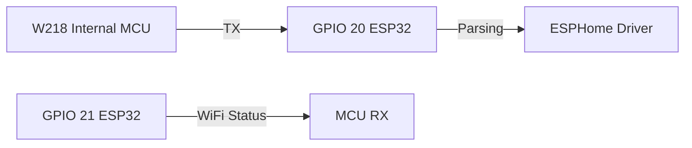

# 🏊‍♂️ Pool Guard Premium: Monitoramento W218 via ESP32-C3

Este projeto transforma um monitor de qualidade de água **Tuya W218 8-in-1** genérico em uma ferramenta poderosa e integrada localmente via **ESPHome**. Substituímos o módulo original WB3S por um **ESP32-C3 Super Mini**, revelando todos os segredos do protocolo serial para controle total.


---

## 🚀 Funcionalidades

- **Monitoramento 8-em-1**: pH, ORP, Temp, TDS, EC, Salinidade, Fator CF e Umidade.
- **Handshake Estabilizado**: Lógica customizada para vencer o deadlock do protocolo Tuya V3.
- **Dashboard Premium**: Acompanhe os dados em tempo real via navegador com interface Glassmorphism.
- **Privacidade Total**: Zero dependência da nuvem Tuya/SmartLife.

---

## ⚙️ 1. Hardware e Conexão

O monitor W218 possui um MCU interno que lê os sensores. O módulo Wi-Fi (WB3S) serve apenas como ponte. Para o transplante, conecte o ESP32-C3 conforme abaixo:

### Diagrama de Pinagem
| WB3S (Original) | ESP32-C3 Super Mini | Função |
| :--- | :--- | :--- |
| **VCC (3.3V)** | **3.3V** | Alimentação |
| **GND** | **GND** | Terra |
| **TX** | **GPIO 21** | Transmissão (ESP -> MCU) |
| **RX** | **GPIO 20** | Recepção (MCU -> ESP) |



> [!WARNING]
> Certifique-se de que a conexão seja direta (3.3V). Não é necessário utilizar resistores na linha serial para este modelo.

---

## 🛠 2. Instalação e Configuração

### Passo 1: Patch do PlatformIO
Se estiver usando versões recentes do Python, pode ocorrer um erro de importação do `fatfs`. Aplique este patch em `~/.platformio/platforms/espressif32/builder/main.py`:

```python
# Torne a importação do fatfs opcional
try:
    import fatfs
except ImportError:
    fatfs = None
```

### Passo 2: Compilação
Use o arquivo `lab-piscina.yml` como base. Ele carrega automaticamente o driver customizado `tuya_w218.h`.

```bash
esphome run lab-piscina.yml
```

---

## 🕵️‍♂️ 3. Segredos do Protocolo Tuya V3 (W218)

Durante o desenvolvimento, deciframos o comportamento "teimoso" do W218:

1.  **O Status 0x04**: O MCU ignora conexões que reportam status `0x03` (apenas WiFi). Você **deve** reportar `0x04` (Cloud Connected) para que ele libere os Data Points (DPs).
2.  **Cabeçalho Fallback**: Embora o MCU use a versão 3 do protocolo, ele muitas vezes ignora respostas com cabeçalho `0x03`. O segredo é responder sempre com a versão `0x00`.
3.  **Proatividade**: O ESP32 deve enviar um Heartbeat (`CMD 0x00`) a cada 10-15 segundos, ou o MCU silencia a UART.

### Tabela de Data Points (DP IDs)
| Sensor | ID | Multiplicador |
| :--- | :--- | :--- |
| pH | 106 | 0.01 |
| ORP | 131 | 1.0 |
| Temperatura | 8 / 108 | 0.1 |
| TDS | 126 | 1.0 |
| EC | 116 | 0.01 |
| Salinidade | 121 | 1.0 |
| Fator CF | 136 | 0.1 |

---

## 🎨 4. Dashboard Web Embutido

Não tem Home Assistant ainda? Sem problemas.
1. Habilitamos o `web_server v2` no ESP32.
2. Abra o arquivo [dashboard.html](dashboard.html) no seu computador.
3. Insira o IP do seu ESP32 e veja a mágica acontecer com um visual premium.

---

## 📄 Licença

Este projeto está licenciado sob a [MIT License](LICENSE). Sinta-se livre para usar, modificar e contribuir!

---
**Desenvolvido com ❤️ para a comunidade de automação residencial.**
