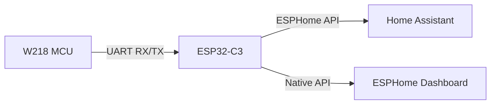

# Projeto PH ORP: Monitoramento W218 via ESP32-C3

Este repositório contém a implementação completa para integração local do monitor de qualidade de água Tuya W218 (8-em-1) utilizando o ecossistema ESPHome. A solução substitui o módulo Wi-Fi original (WB3S) por um ESP32-C3, eliminando a dependência de nuvem e permitindo monitoramento local de alta performance.

## Arquitetura e Hardware

O monitor W218 utiliza um microcontrolador interno (MCU) para a leitura analógica dos sensores, comunicando-se com o módulo de rede via protocolo serial Tuya V3. Para a integração, o módulo original foi removido e substituído por um ESP32-C3 Super Mini.

### Pinagem de Conexão
| WB3S (Original) | ESP32-C3 Super Mini | Função |
| :--- | :--- | :--- |
| VCC (3.3V) | 3.3V | Alimentação |
| GND | GND | Terra |
| TX | GPIO 21 | Transmissão (ESP -> MCU) |
| RX | GPIO 20 | Recepção (MCU -> ESP) |



## Otimizações de Firmware e Estabilidade

Diferente de implementações genéricas, este firmware foi otimizado para evitar travamentos de rede comuns em dispositivos ESP32-C3 operando com múltiplos sensores:

1.  **Gerenciamento de Sockets**: Aumentamos a tabela de sockets do lwIP de 8 para 16 (`CONFIG_LWIP_MAX_SOCKETS: 16`). Isso resolve o erro crítico de "Socket Exhaustion" (ENFILE/errno 23) que ocorre quando o dispositivo gerencia simultaneamente a API, conexões de log e mDNS.
2.  **Redução de Carga de Rede**: O componente `web_server` foi desativado. Isso economiza memória RAM e sockets TCP, priorizando a estabilidade da conexão nativa da API com o Home Assistant.
3.  **Ajuste de Latência**: O modo de economia de energia do Wi-Fi foi desativado (`power_save_mode: none`) para garantir handshakes de criptografia Noise rápidos e estáveis.

## Decifração do Protocolo Tuya V3

Para que o MCU do W218 envie os dados, o driver customizado (`tuya_w218.h`) implementa os seguintes requisitos específicos:

*   **Status de Conectividade**: O status reportado ao MCU deve ser obrigatoriamente `0x04` (Cloud Connected). Status `0x03` resulta em silêncio por parte do MCU.
*   **Versionamento de Cabeçalho**: Embora seja um protocolo v3, as respostas devem utilizar o byte de versão `0x00` para garantir a compatibilidade de recepção pelo MCU original.
*   **Heartbeat**: Implementado intervalo de 10 segundos para manter o watchdog do MCU ativo.

### Mapeamento de Data Points (DP IDs)
| Sensor | ID | Multiplicador | Unidade |
| :--- | :--- | :--- | :--- |
| pH | 106 | 0.01 | pH |
| ORP | 131 | 1.0 | mV |
| Temperatura | 8 / 108 | 0.1 | °C |
| TDS | 126 | 1.0 | ppm |
| EC | 116 | 0.01 | mS/cm |
| Salinidade | 121 | 1.0 | ppm |
| Fator CF | 136 | 0.1 | CF |

## Instalação

1.  Configure suas credenciais no arquivo `secrets.yaml` (utilize o template padrão do ESPHome).
2.  Compile e faça o upload utilizando o ESPHome:
    ```bash
    esphome run lab-piscina.yml
    ```

## Licença

Este projeto é distribuído sob a licença MIT. Consulte o arquivo `LICENSE` para mais detalhes.
